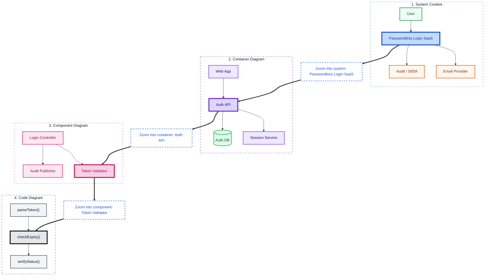

# Example: C4 multi-level (zoom): Passwordless login

Reference template for `c4` anchor (all four levels on one page).

```mermaid
flowchart TB
    classDef person fill:#ecfdf5,stroke:#15803d,stroke-width:2px,color:#14532d
    classDef external fill:#fff7ed,stroke:#ea580c,stroke-width:2px,color:#7c2d12
    classDef system fill:#dbeafe,stroke:#2563eb,stroke-width:2px,color:#1e3a8a
    classDef focusSystem fill:#bfdbfe,stroke:#1d4ed8,stroke-width:4px,color:#1e3a8a
    classDef container fill:#ede9fe,stroke:#7c3aed,stroke-width:2px,color:#3b0764
    classDef focusContainer fill:#ddd6fe,stroke:#6d28d9,stroke-width:4px,color:#2e1065
    classDef component fill:#fce7f3,stroke:#db2777,stroke-width:2px,color:#831843
    classDef focusComponent fill:#fbcfe8,stroke:#be185d,stroke-width:4px,color:#831843
    classDef code fill:#f3f4f6,stroke:#4b5563,stroke-width:2px,color:#111827
    classDef focusCode fill:#e5e7eb,stroke:#111827,stroke-width:4px,color:#111827
    classDef data fill:#dcfce7,stroke:#16a34a,stroke-width:2px,color:#14532d
    classDef zoom fill:#ffffff,stroke:#2563eb,stroke-width:2px,color:#1d4ed8,stroke-dasharray:5 5

    subgraph L1["1. System Context"]
        direction LR
        C_User["User"]:::person
        C_System["Passwordless Login SaaS"]:::focusSystem
        C_Email["Email Provider"]:::external
        C_Audit["Audit / SIEM"]:::external

        C_User --> C_System
        C_System --> C_Email
        C_System --> C_Audit
    end

    Z1["Zoom into system: Passwordless Login SaaS"]:::zoom

    subgraph L2["2. Container Diagram"]
        direction LR
        K_Web["Web App"]:::container
        K_Auth["Auth API"]:::focusContainer
        K_Session["Session Service"]:::container
        K_DB[("Auth DB")]:::data

        K_Web --> K_Auth
        K_Auth --> K_Session
        K_Auth --> K_DB
    end

    Z2["Zoom into container: Auth API"]:::zoom

    subgraph L3["3. Component Diagram"]
        direction LR
        P_Controller["Login Controller"]:::component
        P_Validator["Token Validator"]:::focusComponent
        P_Audit["Audit Publisher"]:::component

        P_Controller --> P_Validator
        P_Controller --> P_Audit
    end

    Z3["Zoom into component: Token Validator"]:::zoom

    subgraph L4["4. Code Diagram"]
        direction LR
        Q_Parse["parseToken()"]:::code
        Q_Check["checkExpiry()"]:::focusCode
        Q_Verify["verifyStatus()"]:::code

        Q_Parse --> Q_Check
        Q_Check --> Q_Verify
    end

    C_System ==> Z1
    Z1 ==> K_Auth
    K_Auth ==> Z2
    Z2 ==> P_Validator
    P_Validator ==> Z3
    Z3 ==> Q_Check

    style L1 fill:#ffffff,stroke:#93c5fd,stroke-width:2px,stroke-dasharray:6 6,color:#111827
    style L2 fill:#ffffff,stroke:#a78bfa,stroke-width:2px,stroke-dasharray:6 6,color:#111827
    style L3 fill:#ffffff,stroke:#f9a8d4,stroke-width:2px,stroke-dasharray:6 6,color:#111827
    style L4 fill:#ffffff,stroke:#9ca3af,stroke-width:2px,stroke-dasharray:6 6,color:#111827
```
