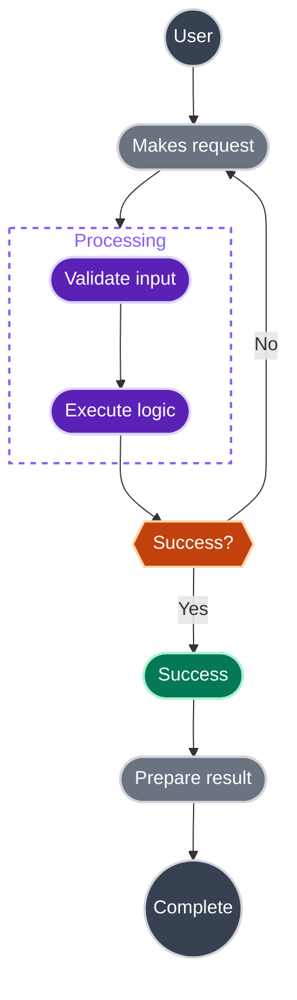

# Example: Flowchart: Generic request with retry

Reference template for `flowchart-<name>`, `decision-<name>`,
`business-logic-<sc-id>` anchors.

```mermaid
flowchart TD
    classDef startEnd fill:#374151,stroke:#d1d5db,stroke-width:2px,color:#fff
    classDef userAction fill:#6b7280,stroke:#d1d5db,stroke-width:2px,color:#fff
    classDef process fill:#5b21b6,stroke:#ddd6fe,stroke-width:2px,color:#fff
    classDef decision fill:#c2410c,stroke:#fed7aa,stroke-width:2px,color:#fff
    classDef success fill:#047857,stroke:#a7f3d0,stroke-width:2px,color:#fff

    User((User)):::startEnd
    User --> Request(["Makes request"]):::userAction

    Request --> Process

    subgraph Process["Processing"]
        direction TB
        Validate(["Validate input"]):::process
        Execute(["Execute logic"]):::process
        Validate --> Execute
    end

    Execute --> Check{{"Success?"}}:::decision
    Check -->|Yes| Success(["Success"]):::success
    Success --> Confirm(["Prepare result"]):::userAction
    Confirm --> Done((Complete)):::startEnd
    Check -->|No| Request

    style Process fill:none,stroke:#8b5cf6,stroke-width:2px,stroke-dasharray:5 5,color:#8b5cf6
```
