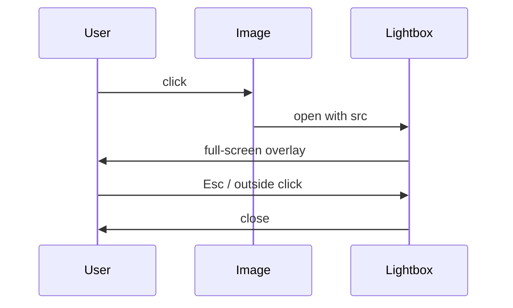

# ImageLightbox

Click any inline image or Mermaid diagram to open it in a full-screen
overlay with pan/zoom. Mounted via the `layout-bottom` slot, so it's
available on every doc page without authors adding markup.

## Triggers

Cursor changes to `zoom-in` on hover (see `base.css`):

```css
.vp-doc img,
.vp-doc svg {
  cursor: zoom-in;
}
```

## Example


