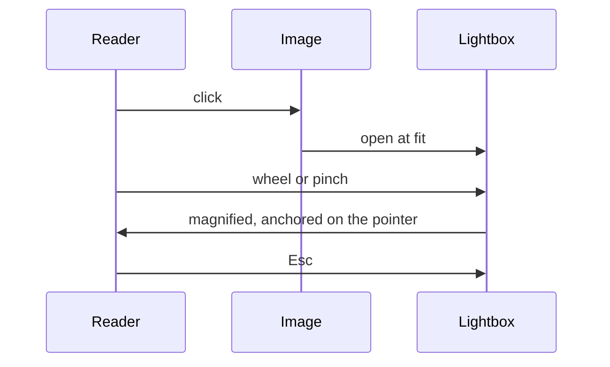

Click any inline image or Mermaid diagram to open it full screen, then zoom into it. Mounted via
the `layout-bottom` slot, so it is available on every doc page without authors adding markup.

Zooming is what makes a wide diagram readable in place. Without it the only way to enlarge one is
the browser's own page zoom, which enlarges the chrome and the body text along with it.

## Gestures

| Gesture                     | Does                                                       |
| --------------------------- | ---------------------------------------------------------- |
| Wheel, or two-finger scroll | Zooms around the pointer, so the detail under it stays put |
| Pinch                       | Zooms and reframes in one gesture                          |
| Drag                        | Pans, once the image is larger than the screen             |
| Double click or double tap  | Toggles between fit and 2.5x                               |
| `+` / `-` / `0`             | Zooms in, out, and back to fit, for keyboard users         |
| `Esc`, or a click outside   | Closes                                                     |

Fit is the floor and 10x is the ceiling. Panning stops at the image's own edges, and an axis that
still fits the screen stays centred, so the picture cannot be dragged off into the backdrop.

## Triggers

The cursor changes to `zoom-in` over anything that opens (see `base.css`). Inline SVG opens only
for Mermaid diagrams and explicit opt-ins, since every icon on the page is an SVG too:

```css
.vp-doc img,
.vp-doc .mermaid svg,
.vp-doc [data-zoomable] {
  cursor: zoom-in;
}
```

## A diagram too wide to read

The labels below are set at 11px against a 1600px canvas. In the reading column they are a blur;
open the image and zoom, and they resolve.


## A Mermaid diagram

Mermaid renders to inline SVG rather than to an image, so the lightbox serializes the diagram
with its computed colours before showing it. It zooms the same way.


