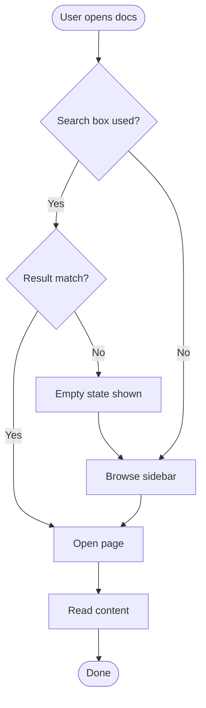
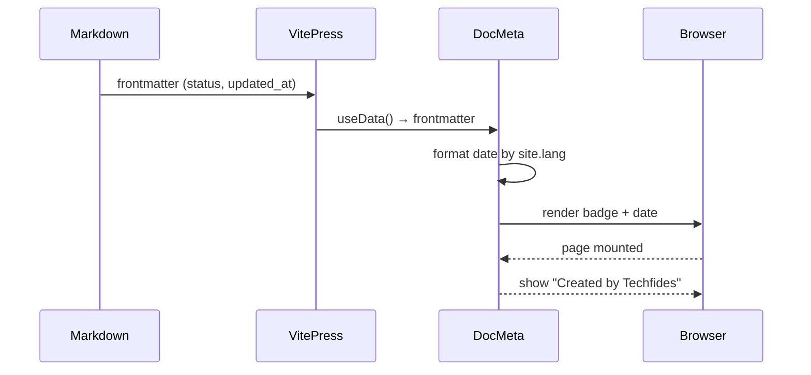
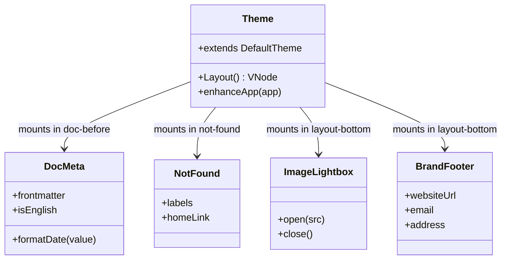

Three different Mermaid diagram types, all picking up the brand
palette from the `--brand-*` CSS tokens (light and dark mode).

## Flowchart — process with decisions

## Sequence — DocMeta rendering

## Class — theme component tree

