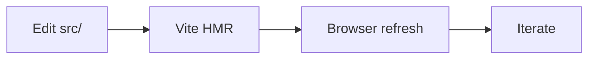

# tf-doc-vault — playground

Lokální sandbox pro vývoj theme + config. Edituj cokoli v
`src/theme/components/*.vue`, `src/theme/styles/*.css`, nebo
`src/config/makeConfig.ts` — Vite HMR překreslí stránku okamžitě,
bez `pnpm build` a bez restartu.

## Co tady testovat

- **Theme komponenty** — `DocMeta`, `ImageLightbox`, `PrintLayout`,
  `WidthToggle`, plus brand komponenty když jsou v branchi
- **Brand tokeny + dark mode** — `theme/styles/base.css`
- **Config factory** — `makeConfig()` chování (sidebar, nav, locales)
- **Mermaid + obrázky** — lightbox cursor, kontrast v dark mode

## Test obsah

### Code block

```ts
import { makeConfig } from "@techfides/tf-doc-vault/config";

export default makeConfig({
  configDir: import.meta.dirname,
  project: "moje_specifikace",
});
```

### Inline `code` v textu

Tohle je odstavec se [zdejším linkem](/v1/) a `inline code` kus.

### Mermaid



### Tabulka

| Sloupec A | Sloupec B | Sloupec C |
| --------- | --------- | --------- |
| Řádek 1   | data      | more      |
| Řádek 2   | data      | more      |
| Řádek 3   | data      | more      |

### Status badge

DocMeta výše ukáže "Publikováno" pill (status z frontmatteru).
