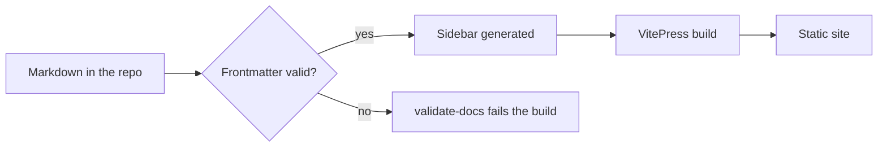

One page holding every construct the theme paints, so a change to the type scale
or a colour token can be judged against all of them at once instead of a page at
a time.

## Headings

The scale runs Inter 600 with `-0.02em` tracking against IBM Plex Sans body text.
An accent hairline opens each `h2`.

### Third level

Sits closer to its `h2` than to the paragraph before it, because it belongs to it.

#### Fourth level

The last level with its own size step. Below this, use bold.

## Running text

A specification is read, not scanned, so the panel holding it is capped at 72
characters and the text takes the panel's width, which at the default layout works
out a little narrower. That is why this paragraph stops where it does rather than
running the full width of the window: past roughly 75 characters the eye loses the
start of the next line and has to hunt for it.

Emphasis comes in two weights. **Bold marks a term being introduced** and shifts
to the display face to say so. _Italic_ carries stress within a sentence. Inline
code such as `makeConfig()` or `--tf-color-panel` gets a faint accent wash rather
than a grey box, and [a link](/v1/tokens/) is accent-coloured with the underline
held back until hover.

## Lists

Unordered items take an accent marker:

- Sidebar and nav generated from the directory tree
- Version switching driven by the `locales` config
- Confluence import, including ADF task lists and attachment resolution

Ordered items use tabular figures, so a long list stays aligned:

1. Label the ticket in Jira
2. The agent plans the change
3. Mandatory project checks run
4. A draft merge request opens
5. A human reviews and merges

Nested, to check the indent:

- Theme
  - Components
    - `DocMeta`, `DocPageTitle`, `BrandHero`
  - Styles
    - `tokens.css`, `icons.css`, `base.css`, `patterns.css`
- Config
  - `makeConfig()`

## Task lists

- [x] Token layer split out of `base.css`
- [x] Inter and IBM Plex Sans wired through `branding.fonts`
- [ ] Print stylesheet revisited against the new scale
  - [x] Panel flattens on paper
  - [ ] ~~Star field suppressed~~

## Quote

> The rule is not that a comment explains the code. It is that a comment says the
> thing the code cannot: the invariant somebody could undo without noticing.

## Tables

Numeric columns detect themselves and align right with tabular figures. The
header is sticky in spirit only: it reads as a header because of the accent wash
and the display face.

| ID     | Requirement                       | Priority | Status      | Owner     | Effort |
| ------ | --------------------------------- | -------- | ----------- | --------- | -----: |
| FR-001 | Sign in with email and password   | Must     | Done        | Auth team |      3 |
| FR-002 | Sign in via company SSO (OIDC)    | Must     | Done        | Auth team |      8 |
| FR-003 | Session expires after 30 min idle | Must     | In progress | Auth team |      2 |
| FR-004 | Reset a forgotten password        | Should   | Done        | Auth team |      5 |
| FR-005 | Second factor via TOTP            | Should   | Blocked     | Sec team  |     13 |
| FR-006 | Remember this device for 30 days  | Could    | Not started | Auth team |      5 |

Wide enough to scroll, to check the edge shadows and the frame:

| Service       | Runtime | Region       | Replicas | CPU request | Memory request | p95 latency | Error rate | On call   |
| ------------- | ------- | ------------ | -------: | ----------: | -------------: | ----------: | ---------: | --------- |
| `srvc-bat`    | Node 24 | eu-central-1 |        3 |       200 m |         512 Mi |      184 ms |     0.02 % | Platform  |
| `srvc-ident`  | Node 24 | eu-central-1 |        4 |       400 m |           1 Gi |       92 ms |     0.01 % | Auth team |
| `srvc-ledger` | Java 21 | eu-central-1 |        2 |       800 m |           2 Gi |      338 ms |     0.11 % | Payments  |
| `srvc-notify` | Node 24 | eu-west-1    |        2 |       100 m |         256 Mi |       61 ms |     0.04 % | Platform  |

## Code

A shell block, to check the language chip and the copy button:

```bash
pnpm install
pnpm dev:docs
```

TypeScript, with a highlighted line:

```ts
import { makeConfig } from "@techfides/tf-doc-vault/config";

export default makeConfig({
  configDir: import.meta.dirname,
  project: "srvc-bat", // [!code highlight]
  branding: {
    siteTitle: "Batch service",
    footer: { websiteUrl: "https://techfides.cz" },
  },
});
```

CSS, to see how the token names read in a block:

```css
.tf-card {
  border: 1px solid var(--tf-color-line);
  border-radius: var(--tf-radius-xl);
  background: var(--tf-color-panel);
  box-shadow: var(--tf-shadow-1);
}
```

## Info panels

::: info
Neutral supplementary information. The one a reader may skip without losing the
thread.
:::

::: tip
Recommendations and established practice. Reach for the tip block when the reader
has a choice and one option is better.
:::

::: warning
Something to watch out for. A warning describes a foot-gun that is still
recoverable.
:::

::: danger
Destructive or irreversible. `changelogen --release` without `--no-github` opens a
browser pre-fill that tags the wrong commit.
:::

::: details What a collapsed block looks like
Detail a reader wants on demand rather than in the flow: a long command, an error
message in full, the third example that only matters when the first two failed.
:::

## Diagram



## Status badges

Rendered from frontmatter by `DocMeta`, and available as a class for use inline:

<span class="doc-status-badge" data-status="published">Published</span>
<span class="doc-status-badge" data-status="review">Review</span>
<span class="doc-status-badge" data-status="draft">Draft</span>
<span class="doc-status-badge" data-status="archived">Archived</span>

## Horizontal rule

---

And the text that follows it, to check the space either side.
