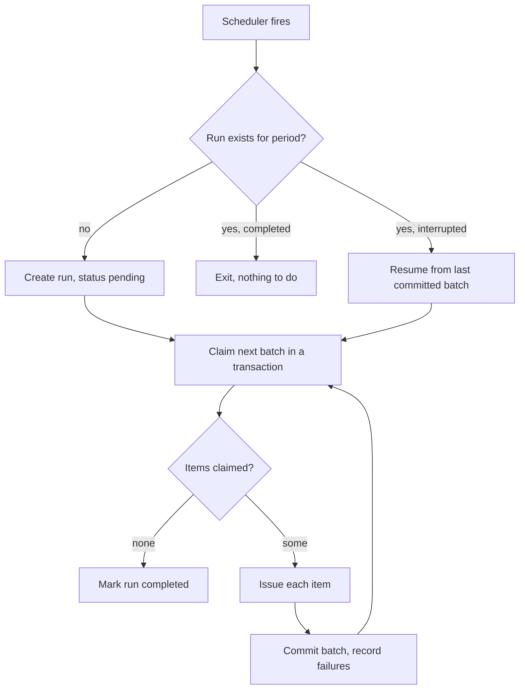

A specification of the length a real one reaches, written to give the vertical
rhythm something to prove itself on. The subject is invented; the shape, the
numbered requirements, the open questions and the decision log are the shape
TechFides analysis documents actually take.

<span class="tf-eyebrow">Analysis · SRVC-BAT</span>

## Purpose

Batch invoicing currently runs as a cron job on a single machine, holds its state
in memory, and has no way to resume a run that dies halfway. In the last quarter
three runs failed after issuing part of a batch, and each took a day of manual
reconciliation to unpick.

This document specifies the replacement: a job that is resumable, observable, and
safe to run twice.

<div class="tf-cards">
  <div class="tf-card">
    <div class="tf-stat">
      <span class="tf-stat__value tf-grad-text">3</span>
      <span class="tf-stat__label">Partial failures last quarter</span>
    </div>
  </div>
  <div class="tf-card">
    <div class="tf-stat">
      <span class="tf-stat__value">~8 h</span>
      <span class="tf-stat__label">Manual reconciliation per failure</span>
    </div>
  </div>
  <div class="tf-card">
    <div class="tf-stat">
      <span class="tf-stat__value">41 k</span>
      <span class="tf-stat__label">Invoices in the largest run</span>
    </div>
  </div>
</div>

## Scope

In scope: the batch runner, its persistence, its metrics, and the operator command
used to resume a run.

Out of scope: the invoice template, the PDF renderer, and anything about how
invoices reach the customer. Those have their own owners and neither changes here.

## Glossary

<dl class="tf-rows">
  <div><dt>Run</dt><dd>One execution over one billing period</dd></div>
  <div><dt>Batch</dt><dd>A slice of a run, sized to fit one transaction</dd></div>
  <div><dt>Item</dt><dd>One invoice within a batch</dd></div>
  <div><dt>Resume</dt><dd>Continuing a run from its last committed batch</dd></div>
</dl>

## Requirements

Priority follows MoSCoW. An item is Done only once its acceptance test is in the
suite and green.

| ID     | Requirement                                              | Priority | Status      | Owner    | Effort |
| ------ | -------------------------------------------------------- | -------- | ----------- | -------- | -----: |
| FR-001 | A run is identified by billing period and created once   | Must     | Done        | Platform |      3 |
| FR-002 | Items are claimed in batches inside one transaction      | Must     | Done        | Platform |      8 |
| FR-003 | A killed run resumes from its last committed batch       | Must     | In progress | Platform |     13 |
| FR-004 | Running the same period twice issues nothing new         | Must     | In progress | Platform |      8 |
| FR-005 | Per-item failures are recorded and do not stop the run   | Must     | Not started | Platform |      5 |
| FR-006 | An operator can resume a run by period from the CLI      | Should   | Not started | Platform |      5 |
| FR-007 | Batch size is configurable per environment               | Should   | Done        | Platform |      2 |
| FR-008 | A dry run reports what it would issue and writes nothing | Could    | Not started | Platform |      8 |

### Non-functional

| ID      | Requirement                                      | Target            | Measured by         |
| ------- | ------------------------------------------------ | ----------------- | ------------------- |
| NFR-001 | A 41 k item run finishes inside the night window | < 90 min          | Run duration metric |
| NFR-002 | Memory stays flat regardless of run size         | < 512 Mi resident | Container metrics   |
| NFR-003 | A resumed run reissues nothing                   | 0 duplicate items | Reconciliation test |
| NFR-004 | Progress is visible while a run is in flight     | Updated per batch | Metrics endpoint    |

## Design

The run is a row, the batch is a transaction, and the item claim is what makes the
whole thing idempotent. Nothing is held in memory that could not be rebuilt by
reading the two tables.



### Why the claim is inside the transaction

Claiming and issuing in one transaction is what makes a second run safe. If the
claim were a separate statement, two runners could both read the same unclaimed
items, and the window between the read and the write is exactly where the
duplicate invoices in March came from.

::: warning
The batch size and the transaction timeout are coupled. A batch large enough to
exceed the statement timeout rolls back the whole slice, and the run then retries
the same slice forever. Raising `BATCH_SIZE` means checking the timeout too.
:::

### Persistence

```sql
CREATE TABLE invoice_run (
  period      date PRIMARY KEY,
  status      text NOT NULL CHECK (status IN ('pending','running','completed','failed')),
  started_at  timestamptz,
  finished_at timestamptz
);

CREATE TABLE invoice_item (
  id         bigserial PRIMARY KEY,
  period     date NOT NULL REFERENCES invoice_run(period),
  account_id bigint NOT NULL,
  claimed_at timestamptz,
  issued_at  timestamptz,
  failure    text,
  UNIQUE (period, account_id)
);
```

The unique constraint on `(period, account_id)` is the last line of defence: even
if the claim logic were wrong, the database refuses the second invoice.

### Configuration

```ts
export interface BatchConfig {
  /** Items per transaction. Raise with the statement timeout, not alone. */
  batchSize: number;
  /** Wall clock after which a claimed-but-unissued item is reclaimable. */
  claimTtlMs: number;
  /** Stop the run after this many consecutive failed batches. */
  failureBudget: number;
}

export const defaults: BatchConfig = {
  batchSize: 250,
  claimTtlMs: 15 * 60_000,
  failureBudget: 3,
};
```

## Operator flow

<div class="tf-rows">
  <div><span><span class="tf-step">1</span> Check the run status for the period</span><span>read only</span></div>
  <div><span><span class="tf-step">2</span> Confirm no runner still holds claims</span><span>claim TTL</span></div>
  <div><span><span class="tf-step">3</span> Resume the run from the CLI</span><span>FR-006</span></div>
  <div><span><span class="tf-step">4</span> Reconcile issued against expected</span><span>NFR-003</span></div>
</div>

```bash
srvc-bat runs status --period 2026-07
srvc-bat runs resume --period 2026-07
```

::: danger
`runs reset` drops the claims for a period so every item is issued again. It exists
for a corrupted run and nothing else. On a completed period it produces a second
invoice for every account.
:::

## Rollout

- [x] Tables and migration behind a feature flag
- [x] Batch claim path with the unique constraint in place
- [ ] Resume path and its reconciliation test
  - [x] Last committed batch derived from `issued_at`
  - [ ] ~~Claim TTL reaper~~ superseded by the resume path
- [ ] Operator CLI
- [ ] Old cron job removed

## Open questions

| #   | Question                                                  | Owner    | Needed by |
| --- | --------------------------------------------------------- | -------- | --------- |
| Q1  | Does a failed item block the period from closing?         | Finance  | Sprint 34 |
| Q2  | Who is paged when the failure budget trips at 03:00?      | Platform | Sprint 33 |
| Q3  | Is a dry run worth building before the first live period? | Platform | Sprint 35 |

## Decision log

| Date       | Decision                              | Why                                                   |
| ---------- | ------------------------------------- | ----------------------------------------------------- |
| 2026-06-18 | State lives in Postgres, not Redis    | The run must survive a cache flush                    |
| 2026-06-24 | Claim and issue share one transaction | Closes the duplicate window seen in March             |
| 2026-07-02 | Batch size configurable, default 250  | 250 fits the statement timeout with room to spare     |
| 2026-07-29 | Claim TTL reaper dropped              | The resume path covers the same case with less moving |

> The reaper and the resume path solved the same problem from two ends. Keeping
> both meant two ways for a claim to be released and no single place to reason
> about it.

## References

- [Design tokens](/v1/tokens/) for the visual language this page is set in
- [Every element](/v1/showcase/001-elements) for the constructs in isolation
