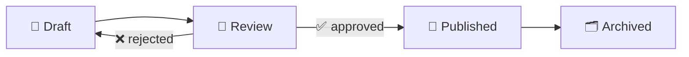

Emoji rendered inside `.vp-doc` prose, tables and headings. This page
collects the 100 emoji that actually come up in specifications, technical
documentation and cooperation offers, so their size, baseline alignment
and colour behaviour in light and dark mode can be checked in one place.

Emoji are painted by **Noto Color Emoji**, loaded with Open Sans from
Google Fonts and listed in `--vp-font-family-base` and
`--vp-font-family-mono`. The reader's OS font is not used, so the same
glyph appears on Windows, macOS, Linux, Android and in the PDF export.
Sizing still comes from the surrounding text: emoji inherit `font-size`
and `line-height` and have no tokens of their own.

## Status and progress

| Emoji | Meaning          | Typical use                             |
| ----- | ---------------- | --------------------------------------- |
| ✅    | Done             | Completed requirement, approved chapter |
| ❌    | Rejected         | Out of scope, failed acceptance test    |
| ⚠️    | Warning          | Known limitation, risky assumption      |
| 🚧    | Work in progress | Draft section, unfinished analysis      |
| 🔄    | In review        | Awaiting client or internal review      |
| ⏳    | Pending          | Waiting on a decision or third party    |
| 🆕    | New              | Newly added requirement or feature      |
| 🐛    | Defect           | Bug report, known issue list            |
| 🔥    | Critical         | Blocker, production incident            |
| 🚫    | Blocked          | Cannot start, hard constraint           |
| ✔️    | Verified         | Checklist item confirmed                |
| ❗    | Important        | Must-read note in an offer or spec      |

## Priority and emphasis

| Emoji | Meaning         | Typical use                          |
| ----- | --------------- | ------------------------------------ |
| 🔴    | High priority   | Must-have in a MoSCoW table          |
| 🟡    | Medium priority | Should-have, nice to schedule        |
| 🟢    | Low priority    | Could-have, healthy status           |
| 🔵    | Informational   | Neutral marker in a legend           |
| ⭐    | Highlight       | Key benefit in an offer              |
| 💡    | Tip / idea      | Recommendation, improvement proposal |
| 📌    | Pinned          | Note the reader must not skip        |
| ❓    | Open question   | Unresolved point for the client      |

## Documents and content

| Emoji | Meaning           | Typical use                          |
| ----- | ----------------- | ------------------------------------ |
| 📄    | Document          | Single page or deliverable           |
| 📃    | Text output       | Generated report, log excerpt        |
| 📋    | Requirement list  | Backlog, acceptance criteria         |
| 📝    | Notes / draft     | Meeting minutes, working draft       |
| 📑    | Sections          | Table of contents, chapter overview  |
| 📚    | Documentation set | Whole docs site, reading list        |
| 📁    | Folder            | Repository directory, document group |
| 📂    | Open folder       | Currently relevant folder in a tree  |
| 🗂️    | Index / archive   | Document register, versioned archive |
| 🔖    | Version tag       | Release note, document revision      |
| 🖇️    | Attachment        | Annex, external file                 |
| ✍️    | Authorship        | Signature, approval line             |

## Process and workflow

| Emoji | Meaning          | Typical use                         |
| ----- | ---------------- | ----------------------------------- |
| 🎯    | Goal             | Objective of a project or chapter   |
| 🗺️    | Roadmap          | Phased delivery plan                |
| 🧭    | Scope            | Scope statement, guiding principle  |
| 🔀    | Alternative flow | Branch in a use case, variant B     |
| ➡️    | Next step        | Sequence of steps, hand-off         |
| 🔁    | Recurring        | Periodic task, maintenance loop     |
| ⚙️    | Configuration    | Settings, process definition        |
| 🛠️    | Implementation   | Build phase, technical work item    |
| 🧩    | Component        | Module, integrated part of a system |
| 🚀    | Release          | Go-live, deployment milestone       |

## People and roles

| Emoji | Meaning          | Typical use                            |
| ----- | ---------------- | -------------------------------------- |
| 👤    | Actor / user     | Use case actor, single persona         |
| 👥    | Team             | Stakeholders, delivery team            |
| 🧑‍💻    | Developer        | Engineering role in a RACI table       |
| 🧑‍🎨    | Designer         | UX or visual design role               |
| 🧑‍💼    | Client / manager | Product owner, sponsor                 |
| 🧑‍⚖️    | Legal            | Compliance reviewer, contractual point |
| 🤝    | Agreement        | Cooperation model, signed scope        |
| 🗣️    | Feedback         | Interview, workshop input              |
| 📞    | Call             | Contact channel, support line          |
| ✉️    | Email            | Contact details, notification          |

## Commercial and offer

| Emoji | Meaning   | Typical use                         |
| ----- | --------- | ----------------------------------- |
| 💰    | Budget    | Total price, cost overview          |
| 💵    | Rate      | Day rate, unit price                |
| 💳    | Payment   | Payment terms, billing method       |
| 🧾    | Invoice   | Invoicing schedule                  |
| 📈    | Growth    | Expected benefit, scaling           |
| 📉    | Reduction | Cost saving, reduced effort         |
| 📊    | Metrics   | KPI table, measured result          |
| 🏆    | Result    | Reference project, achieved outcome |
| 🎁    | Included  | Bonus item, free of charge          |
| ⚖️    | Terms     | SLA balance, legal conditions       |
| 📅    | Date      | Delivery date, contract period      |
| ⏱️    | Estimate  | Effort in hours, time box           |

## Technology and infrastructure

| Emoji | Meaning        | Typical use                           |
| ----- | -------------- | ------------------------------------- |
| 💻    | Application    | Client app, local environment         |
| 🖥️    | Server         | Backend host, workstation             |
| 📱    | Mobile         | Mobile app, responsive requirement    |
| 🗄️    | Database       | Data store, schema chapter            |
| ☁️    | Cloud          | Hosting model, managed service        |
| 🌐    | Web / network  | Public endpoint, network topology     |
| 🔌    | Integration    | API connection, third-party system    |
| 🔒    | Security       | Access control, hardening requirement |
| 🔑    | Credentials    | Authentication, secret management     |
| 🧪    | Test           | Test case, verification step          |
| 📦    | Package        | Artefact, dependency, deliverable     |
| 🔍    | Search / audit | Full-text search, code audit          |

## Analysis and quality

| Emoji | Meaning          | Typical use                        |
| ----- | ---------------- | ---------------------------------- |
| 🔬    | Deep analysis    | Detailed investigation, root cause |
| 🧠    | Domain knowledge | Business rule, conceptual model    |
| 📐    | Specification    | Formal requirement, measurement    |
| 🧮    | Calculation      | Pricing model, capacity estimate   |
| ✏️    | Revision         | Change request, edited passage     |
| 🗃️    | Data set         | Migration input, reference data    |
| ♻️    | Refactoring      | Technical debt item, rework        |
| 🧹    | Cleanup          | Removal of legacy behaviour        |

## Time and planning

| Emoji | Meaning     | Typical use                          |
| ----- | ----------- | ------------------------------------ |
| 🕐    | Duration    | Time spent, elapsed period           |
| ⌛    | Deadline    | Hard date, expiring offer            |
| 🗓️    | Schedule    | Sprint plan, calendar of phases      |
| ⏰    | Reminder    | Follow-up, escalation trigger        |
| 🚩    | Milestone   | Phase gate, flagged risk             |
| 🏁    | Finish      | Project completion, final acceptance |
| 🔜    | Coming soon | Planned but not yet started          |
| 📆    | Planning    | Capacity planning, availability      |

## Communication and references

| Emoji | Meaning       | Typical use                          |
| ----- | ------------- | ------------------------------------ |
| 💬    | Comment       | Review remark, inline discussion     |
| 📢    | Announcement  | Change notice, release communication |
| 🔗    | Link          | Cross-reference, external source     |
| 📬    | Handover      | Delivery of a document or artefact   |
| 👍    | Informal OK   | Verbal approval, agreed in a call    |
| 👀    | Under review  | Being read, watchers assigned        |
| 🤔    | Consideration | Risk to weigh, decision pending      |
| ℹ️    | Info          | Neutral explanatory note             |

## Outside prose

Three surfaces declare their own font stack and would otherwise fall back
to the reader's OS emoji font. They render here so a regression is visible.

Inline code and code blocks (`--vp-font-family-mono`): `status: ✅ done`,
`priority: 🔴 high`.

```yaml
review:
  status: ✅ approved
  blocker: 🚫 none
  owner: 🧑‍💻 platform
```

Mermaid diagrams, which inject their own `#mermaid-N { font-family }` into
the SVG (`mermaid.fontFamily` in `makeConfig`):



The third is the PDF export (`PrintLayout.vue`), which is not reachable
from the playground: check it on a scaffolded site with
`tf-doc-vault print`.

## Usage guidelines

Emoji are decoration, never the only carrier of meaning: a status column
that shows ✅ must also contain the word, otherwise the value is lost in
a PDF export, in a screen reader and in grep.

Keep one emoji per cell or per list item. Two or more read as noise and
break the vertical rhythm of a table row.

Pick one emoji per meaning across a whole document and stay with it. A
legend at the top of the page is cheaper than a reader guessing whether
🔴 and 🔥 mean the same thing.

Headings stay clean. An emoji in a heading ends up in the sidebar, in the
in-page outline and in the PDF bookmarks, where it competes with the
title text.

ZWJ sequences (🧑‍💻, 🧑‍💼) compose correctly as long as Noto Color Emoji
loads. On a site built with `branding.fonts: "none"`, or behind a network
that blocks fonts.gstatic.com, they fall back to the OS font and may split
into separate glyphs: prefer a single-codepoint emoji in documents that
must survive that.

<style scoped>
/* Catalogue-only sizing: the first column is the specimen, not data. */
.vp-doc table td:first-child {
  font-size: 2rem;
  line-height: 1;
  text-align: center;
  white-space: nowrap;
}
</style>
