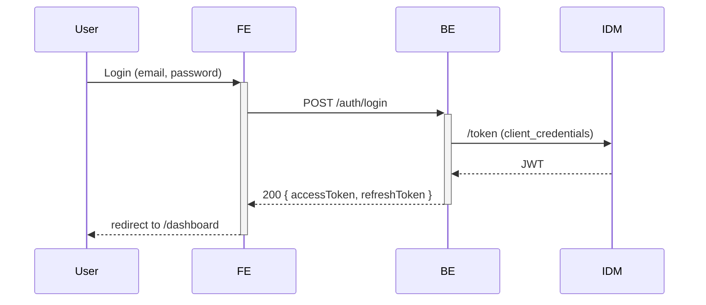
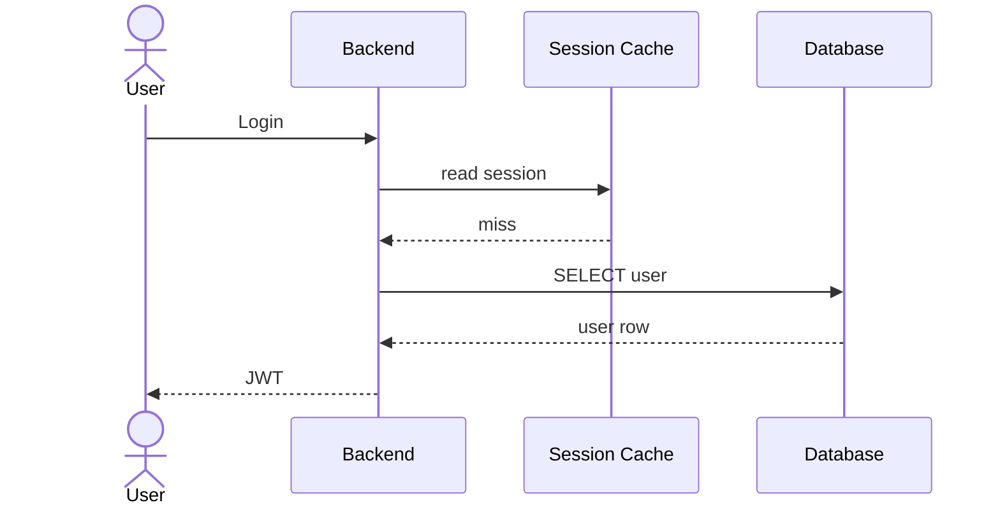

# Evidence rules (diagrams phase)

Rules for tracing every diagram element (node, edge, label,
cardinality, order, branch) back to a source — either the codebase
(primary) or the already-generated docs (secondary). A diagram element
without evidence is a hallucination; use `⚠️ TODO: [what is missing]`
instead.

## The rule, in one sentence

If an element has no citation in code or in the host page's text (or a
linked doc page), it does not belong in the diagram — mark the gap
with a TODO instead.

## What counts as evidence per element

| Element                    | Acceptable evidence                                                                             |
| -------------------------- | ----------------------------------------------------------------------------------------------- |
| Actor (User, Admin, …)     | role constant in code + `technical/roles-matrix.md`                                             |
| Service / component node   | package / module / service folder + `tech-stack.md` or `architecture/components.md`             |
| Class / interface / enum   | source file `path:line` (declaration site)                                                      |
| Table / entity             | migration file `path:line` or ORM model `path:line`                                             |
| Column / field             | migration `path:column-name` or ORM field `path:line`                                           |
| Edge / relationship        | call site in code (`clientA.call(B)`), FK in migrations, event publish/subscribe, config wiring |
| Cardinality (1..N)         | FK with unique constraint (1..1), FK without (1..N), join table (M..N); never assumed           |
| Protocol label (REST, SQL) | client library import, transport config                                                         |
| Sequence step / order      | top-down order in the orchestrating function / saga                                             |
| State / transition         | state enum + transition function `path:line`                                                    |
| Decision / branch          | `if` / `switch` / guard clause `path:line`                                                      |
| Deployment node            | `k8s/`, `terraform/`, `docker-compose.yml` resource entry                                       |

A claim with no entry in this table needs human review — flag it and
ask in the Step 1 plan.

## Citation in the diagram itself

Diagrams are visual — they don't carry file paths inline. Evidence
lives in two places:

1. **The textual summary above the diagram** — mention the primary
   evidence file, e.g.:

   > Diagram odráží runtime chování přihlašovacího scénáře definovaného
   > v `src/auth/login.service.ts:42` a volajícího `IdmClient` (viz
   > `src/auth/idm/idm.client.ts`).

2. **TODO markers under the diagram** — every element without evidence
   gets a marker right below the block:

   ```markdown
   > ⚠️ TODO: cardinality `User → Session` — v kódu není unique
   > constraint, ale model v `src/session.entity.ts` naznačuje 1..N;
   > potvrdit s DB schema.
   ```

## Primary vs. secondary evidence

- **Primary (code)** — always preferred for behavior (edges, order,
  branches, cardinalities). If the code disagrees with a previously
  generated doc, the code wins and the discrepancy becomes a
  `diagram-text-contradiction` TODO during Step 3.
- **Secondary (already-generated docs)** — acceptable for high-level
  structural elements that were already verified against the code in
  an earlier phase (e.g. actor names from `roles-matrix.md`, protocol
  labels from `integrations/overview.md`, entity names from
  `architecture/domain-model.md`).

**ALWAYS** open the code at least once per diagram to confirm the
behavior the diagram encodes — even when the secondary source looks
complete. Docs drift; code is current.

## Common hallucination patterns to avoid

- **Made-up cardinalities** (`1..N` drawn without a FK to justify it).
- **Implied protocols** (`REST` labeled on an edge that is actually
  an in-process call).
- **Composite actors** (`Customer` bundling multiple roles the code
  treats separately, like `buyer` and `guest`).
- **Invisible participants** (adding a `CacheLayer` node because it
  "should be there" — if the code path does not touch it for this
  scenario, it does not belong on the diagram).
- **Missing error branches** (drawing only the happy path when the
  host text enumerates the rainy scenarios — every branch the text
  mentions must appear in the diagram, or the discrepancy goes to
  Step 3 as a contradiction).
- **Renaming for aesthetics** (`UserSvc` instead of `UserService` —
  names follow the code).

## Examples

### Good — traced evidence

Diagram element:



Evidence summary (above the block):

> Orchestrace v `src/auth/login.service.ts:22`, volá `IdmClient.token()`
> (`src/auth/idm/idm.client.ts:55`). Chování odpovídá kap. 1.11.1
> `Přihlášení uživatele`.

### Bad — hallucinated branch



The `Cache` participant and the `read session` / `miss` round-trip do
**not** appear in `login.service.ts`. The session-cache lookup exists
in the codebase — but only for the **session-refresh** scenario, not
for first-time login. Drawing it here creates a plausible-looking but
invented branch.

Marker (under the block in the host page):

```markdown
> ⚠️ TODO: diagram–text contradiction — Cache node neodpovídá login
> scénáři, patří do refresh flow.
```

## Rules (recap)

- **NEVER** invent a node, edge, label, or cardinality.
- **NEVER** copy a structural claim from a doc page without cross-
  checking the code at least once.
- **ALWAYS** mention the primary evidence file in the textual summary
  above the diagram.
- **ALWAYS** mark every unclear element with a `⚠️ TODO` under the
  block; the orchestrator resolves them in its TODO-resolution step.
- **ALWAYS** keep node names identical to their code names —
  translations break cross-diagram consistency.
