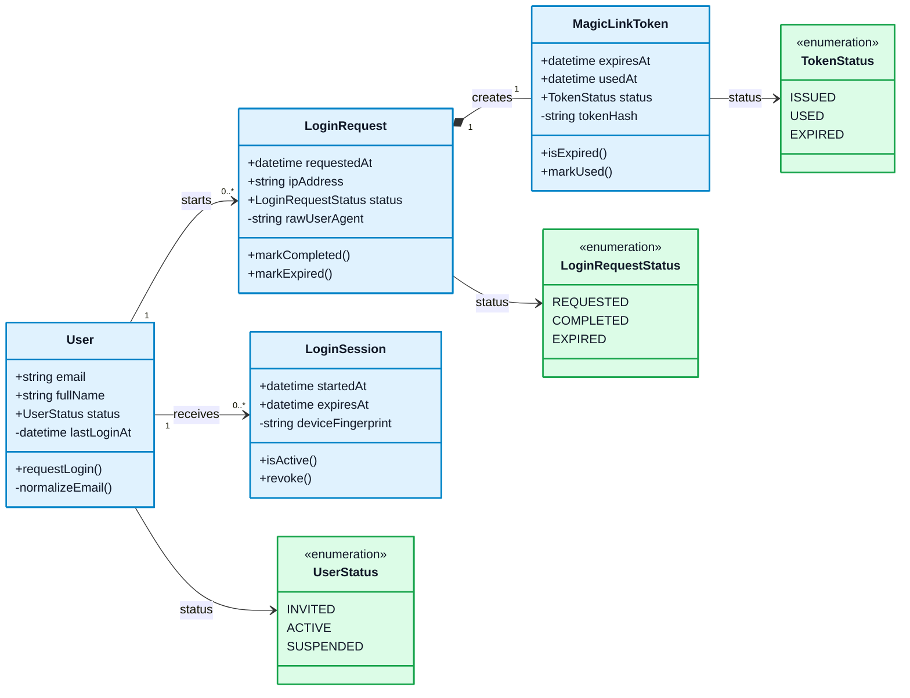

# Example — Class diagram: Passwordless login domain model

Reference template for `domain-model` anchor.

```mermaid
classDiagram
  direction LR

  class User:::entity {
    +string email
    +string fullName
    +UserStatus status
    -datetime lastLoginAt
    +requestLogin()
    -normalizeEmail()
  }

  class LoginRequest:::entity {
    +datetime requestedAt
    +string ipAddress
    +LoginRequestStatus status
    -string rawUserAgent
    +markCompleted()
    +markExpired()
  }

  class MagicLinkToken:::entity {
    +datetime expiresAt
    +datetime usedAt
    +TokenStatus status
    -string tokenHash
    +isExpired()
    +markUsed()
  }

  class LoginSession:::entity {
    +datetime startedAt
    +datetime expiresAt
    -string deviceFingerprint
    +isActive()
    +revoke()
  }

  class UserStatus:::enum {
    <<enumeration>>
    INVITED
    ACTIVE
    SUSPENDED
  }

  class LoginRequestStatus:::enum {
    <<enumeration>>
    REQUESTED
    COMPLETED
    EXPIRED
  }

  class TokenStatus:::enum {
    <<enumeration>>
    ISSUED
    USED
    EXPIRED
  }

  User "1" --> "0..*" LoginRequest : starts
  LoginRequest "1" *-- "1" MagicLinkToken : creates
  User "1" --> "0..*" LoginSession : receives

  User --> UserStatus : status
  LoginRequest --> LoginRequestStatus : status
  MagicLinkToken --> TokenStatus : status

  classDef entity fill:#e0f2fe,stroke:#0284c7,color:#111827,stroke-width:2px
  classDef enum fill:#dcfce7,stroke:#16a34a,color:#111827,stroke-width:2px
```
