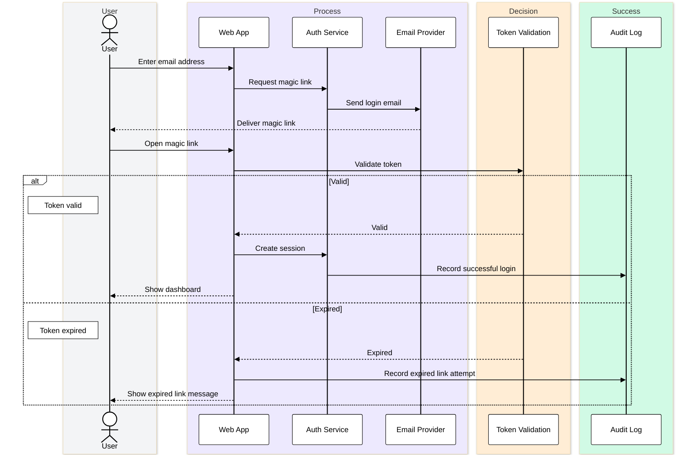

# Example — Sequence: Passwordless login (magic link)

Reference template for `flow-<sc-id>` / `sequence-<name>` anchors.

```mermaid
---
config:
  theme: base
  themeVariables:
    actorBkg: "#ffffff"
    actorBorder: "#000000"
    actorTextColor: "#000000"
    actorLineColor: "#000000"
    signalColor: "#000000"
    signalTextColor: "#000000"
    labelBoxBkgColor: "#ffffff"
    labelBoxBorderColor: "#000000"
    labelTextColor: "#000000"
    noteBkgColor: "#ffffff"
    noteBorderColor: "#000000"
    noteTextColor: "#000000"
---
sequenceDiagram
  box rgb(243,244,246) User
    actor User
  end

  box rgb(237,233,254) Process
    participant WebApp as Web App
    participant Auth as Auth Service
    participant Email as Email Provider
  end

  box rgb(255,237,213) Decision
    participant Validator as Token Validation
  end

  box rgb(209,250,229) Success
    participant Audit as Audit Log
  end

  User->>WebApp: Enter email address
  WebApp->>Auth: Request magic link
  Auth->>Email: Send login email
  Email-->>User: Deliver magic link

  User->>WebApp: Open magic link
  WebApp->>Validator: Validate token

  alt Valid
    Note left of User: Token valid
    Validator-->>WebApp: Valid
    WebApp->>Auth: Create session
    Auth->>Audit: Record successful login
    WebApp-->>User: Show dashboard
  else Expired
    Note left of User: Token expired
    Validator-->>WebApp: Expired
    WebApp->>Audit: Record expired link attempt
    WebApp-->>User: Show expired link message
  end
```
