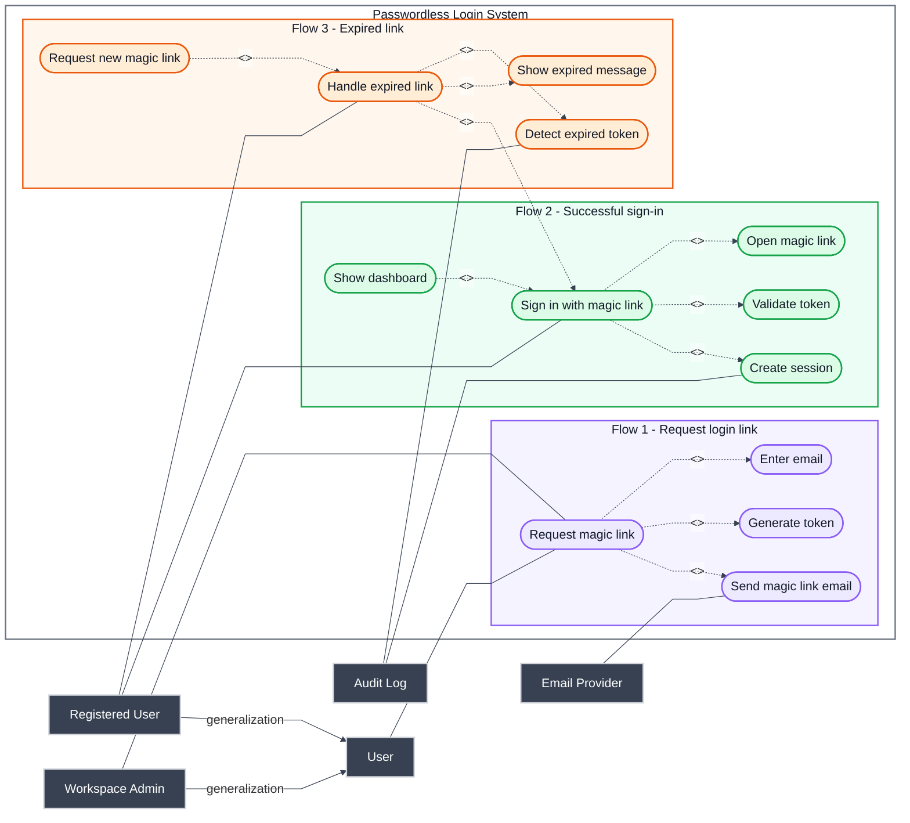

# Example — Use-case: Passwordless login module

Reference template for `use-case-all` / `use-case-<module>` anchors.

```mermaid
---
config:
  theme: base
  flowchart:
    curve: linear
  themeVariables:
    fontSize: 18px
    lineColor: "#374151"
    edgeLabelBackground: "#ffffff00"
---
flowchart LR
    classDef actor fill:#374151,stroke:#d1d5db,stroke-width:2px,color:#fff
    classDef request fill:#ede9fe,stroke:#8b5cf6,stroke-width:2px,color:#111827
    classDef success fill:#dcfce7,stroke:#16a34a,stroke-width:2px,color:#111827
    classDef expired fill:#ffedd5,stroke:#ea580c,stroke-width:2px,color:#111827

    User[User]:::actor
    RegisteredUser[Registered User]:::actor
    WorkspaceAdmin[Workspace Admin]:::actor
    EmailProvider[Email Provider]:::actor
    AuditLog[Audit Log]:::actor

    RegisteredUser -->|generalization| User
    WorkspaceAdmin -->|generalization| User

    subgraph System["Passwordless Login System"]
        direction TB

        subgraph F1["Flow 1 - Request login link"]
            direction TB
            UC1([Request magic link]):::request
            UC1a([Enter email]):::request
            UC1b([Generate token]):::request
            UC1c([Send magic link email]):::request

            UC1 -. "<<include>>" .-> UC1a
            UC1 -. "<<include>>" .-> UC1b
            UC1 -. "<<include>>" .-> UC1c
        end

        subgraph F2["Flow 2 - Successful sign-in"]
            direction TB
            UC2([Sign in with magic link]):::success
            UC2a([Open magic link]):::success
            UC2b([Validate token]):::success
            UC2c([Create session]):::success
            UC2d([Show dashboard]):::success

            UC2 -. "<<include>>" .-> UC2a
            UC2 -. "<<include>>" .-> UC2b
            UC2 -. "<<include>>" .-> UC2c
            UC2d -. "<<extend>>" .-> UC2
        end

        subgraph F3["Flow 3 - Expired link"]
            direction TB
            UC3([Handle expired link]):::expired
            UC3a([Detect expired token]):::expired
            UC3b([Show expired message]):::expired
            UC3c([Request new magic link]):::expired

            UC3 -. "<<include>>" .-> UC3a
            UC3 -. "<<include>>" .-> UC3b
            UC3c -. "<<extend>>" .-> UC3
            UC3 -. "<<extend>>" .-> UC2
        end
    end

    User --- UC1
    RegisteredUser --- UC2
    RegisteredUser --- UC3
    WorkspaceAdmin --- UC1

    EmailProvider --- UC1c
    AuditLog --- UC2c
    AuditLog --- UC3a

    style System fill:none,stroke:#6b7280,stroke-width:2px,color:#111827
    style F1 fill:#f5f3ff,stroke:#8b5cf6,stroke-width:2px,color:#111827
    style F2 fill:#ecfdf5,stroke:#16a34a,stroke-width:2px,color:#111827
    style F3 fill:#fff7ed,stroke:#ea580c,stroke-width:2px,color:#111827
```
