# Mermaid cheatsheet

Idiomatic Mermaid syntax for each diagram type this skill produces.
Every block below is meant to be validated by the script referenced in
`SKILL.md` (Step 2, item 5) before it ships into a host page.

> This document is intentionally kept short and structural. **Canonical
> examples live in `resources/examples/`** and carry the authoritative
> styling (theme blocks, `classDef` palettes, `subgraph` grouping) —
> each diagram-type section below links to its example. When in doubt,
> copy from the example and adapt, don't reinvent styling.

## Rendering context

- Mermaid blocks are fenced as ` ```mermaid `.
- VitePress renders Mermaid when Mermaid support/plugin is enabled. If
  it is missing, the block falls back to a code listing — therefore a
  **textual summary above the diagram is mandatory** (`SKILL.md`, Step 2
  item 3).
- Keep node identifiers short and stable (same identifier across
  related diagrams) so the diff is readable.
- Do NOT use HTML in node labels unless strictly necessary — it breaks
  the validator in older Mermaid versions.
- Avoid placeholder labels that look like HTML tags, for example
  `<action>` or `<Scenario>`. Prefer plain placeholder text such as
  `Action`, `Scenario`, or `Condition`.

## 1. Sequence diagram

Used for `flow-<sc-id>`, `runtime-<name>`, `sequence-<name>`.

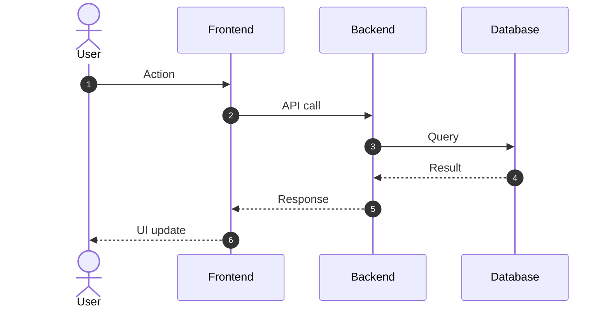

Key syntax:

- `autonumber` — adds step numbers matching the text's numbered list.
- `->>` solid request/call arrow, `-->>` dotted response arrow,
  `->>+` / `-->>-` for activation boxes. Use `-)` / `--)` only when
  an async/open-arrow notation is intentional.
- `Note over X,Y: ...` for contextual notes drawn from the code.
- `alt / else / end`, `opt / end`, `loop / end`, `par / and / end` for
  branching / optional paths / loops / parallel steps — only when the
  host text also describes them.

Canonical example: [`examples/sequence-passwordless-login.md`](examples/sequence-passwordless-login.md).

## 2. Use-case diagram

Mermaid does not have a first-class use-case syntax. Use a
`flowchart LR` with actor nodes on the left and use-case nodes on the
right, connected by labeled edges.

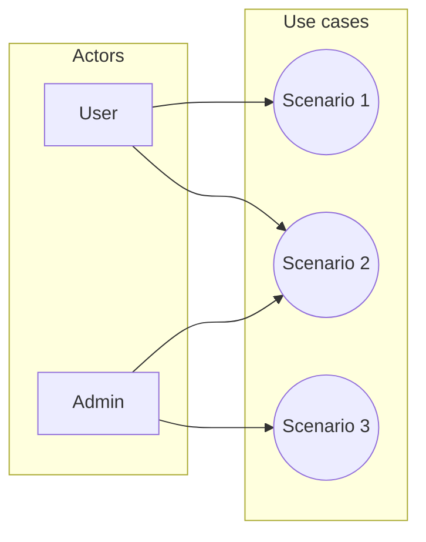

For richer use-case semantics (include / extend), fall back to
PlantUML — see `plantuml-fallback.md`.

Canonical example: [`examples/use-case-passwordless-login.md`](examples/use-case-passwordless-login.md).

## 3. Component diagram

Used for `components`. A `flowchart TB` or `LR` with subgraphs per
deployable unit works for 90 % of projects.

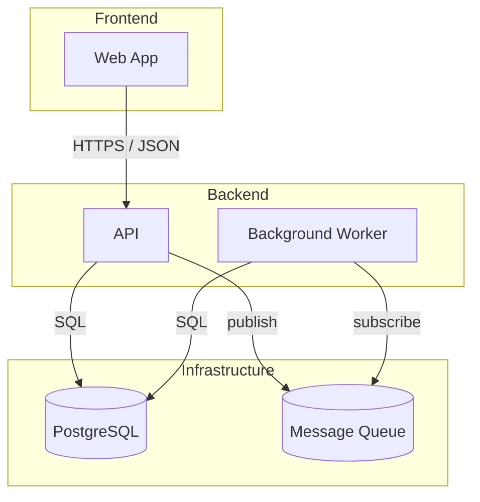

Key choices:

- Label every edge with the **protocol / content type** (e.g. `REST`,
  `gRPC`, `SQL`, `AMQP`, `Kafka`). The host page's text must call them
  out (see `consistency-check.md`).
- Use `[(...)]` for databases. Use other shapes such as `[[...]]` or
  `((...))` only as visual conventions, not as Mermaid-enforced
  package/service semantics.

No canonical component example yet — derive from the C4 Container
level of [`examples/c4-passwordless-login.md`](examples/c4-passwordless-login.md)
when needed.

## 4. C4-style diagrams (Context, Container, Component)

Mermaid has experimental native C4 syntax, but this cheatsheet uses
regular `flowchart` diagrams for C4-style views so the output stays
consistent with the validator and host renderer. Use `flowchart LR` for
system context diagrams and `flowchart TB` or `LR` for container and
component diagrams.

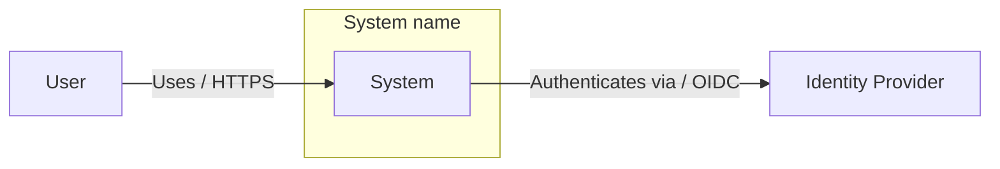

For container views, keep the same pattern and put containers inside the
system boundary.

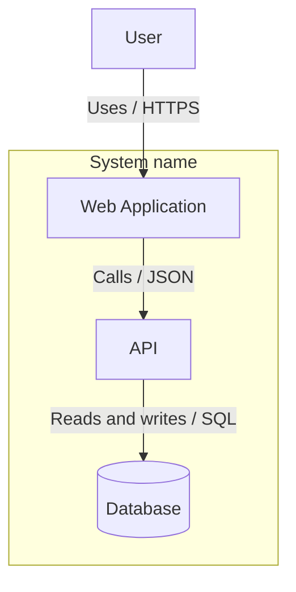

Key choices:

- Use `subgraph` to represent system boundaries, containers, or major
  deployable units.
- Label relationships with both the intent and protocol when useful,
  for example `Uses / HTTPS`, `Calls / JSON`, or `Publishes / Kafka`.
- Keep C4-style flowcharts simple. Fall back to PlantUML C4 when layout,
  tags, legends, or advanced C4 semantics matter.

Canonical example (all 4 levels stacked with zoom arrows):
[`examples/c4-passwordless-login.md`](examples/c4-passwordless-login.md).

## 5. Class diagram (domain model)

Used for `domain-model`.

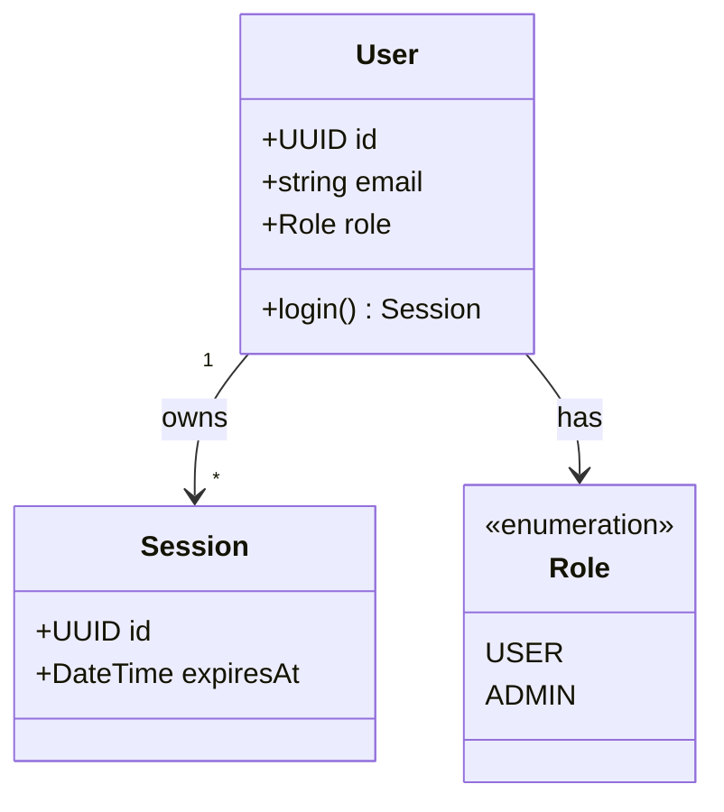

Key syntax:

- `+` public, `-` private, `#` protected, `~` package-private.
- `<<abstract>>`, `<<interface>>`, `<<enumeration>>` stereotypes.
- Cardinality labels on associations: `"1" --> "*"`, `"1" --> "0..1"`.

### Functional vs. technical domain diagram — level of detail

A domain diagram appears in **two** places with **different audiences**,
and the level of detail differs:

| Section                       | Show attributes | Visibility (`+`/`-`/`#`/`~`) | Show methods | Show enums and cardinalities |
| ----------------------------- | --------------- | ---------------------------- | ------------ | ---------------------------- |
| Functional documentation (§1) | yes             | **NO**                       | **NO**       | yes                          |
| Technical documentation (§2)  | yes             | yes                          | yes          | yes                          |

**Functional** domain diagrams describe _what the business concepts
look like_ — product / analyst audience. They MUST omit visibility
modifiers and method signatures: those are implementation details that
add noise without business value.

**Technical** domain diagrams describe _how the classes are shaped in
code_ — engineering audience. They include full visibility and method
signatures, as in the canonical example below.

Functional variant of the same class (strip `+`/`-`/`#`/`~` and methods):

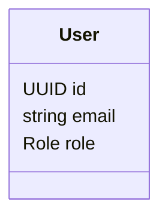

Technical variant (full detail):

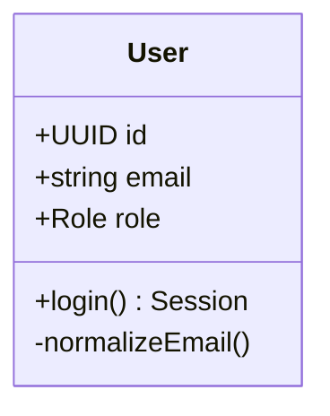

Do **NOT** duplicate methods into the functional diagram "for
completeness" and do **NOT** strip them from the technical diagram "to
match the functional one" — the two live side by side on purpose.

Canonical example (technical detail): [`examples/class-passwordless-login.md`](examples/class-passwordless-login.md).

## 6. ERD (entity-relationship diagram)

Used for `data-model`, `erd`.

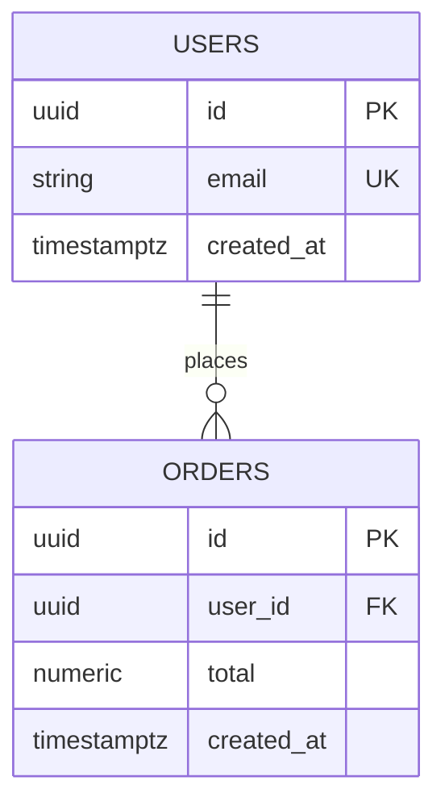

- `||--o{` one-to-many, `||--||` one-to-one, `}o--o{` many-to-many.
- Use `--` for identifying relationships and `..` for non-identifying
  relationships when that distinction matters.
- Column annotations: `PK`, `FK`, `UK`.
- Use the **actual DB column types** from migrations / schema — not
  language-level types.
- For logical ERDs, prefer singular entity names. For physical data
  models, use the actual table names from the database schema, even if
  they are plural.

No canonical ERD example yet — follow the cheatsheet block above; use the
`entity` / `datastore` palette from the class-diagram example for
consistency.

## 7. State diagram

Used for `state-<name>`.

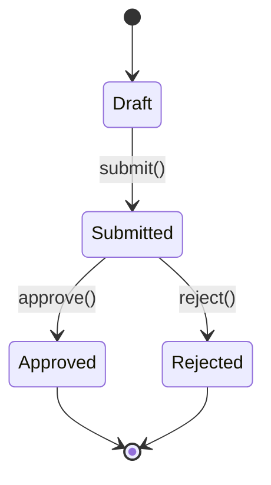

- `[*]` start / end.
- Transition label is the **event / method name** from the code.
- Use block notes for guards when the text enumerates them.

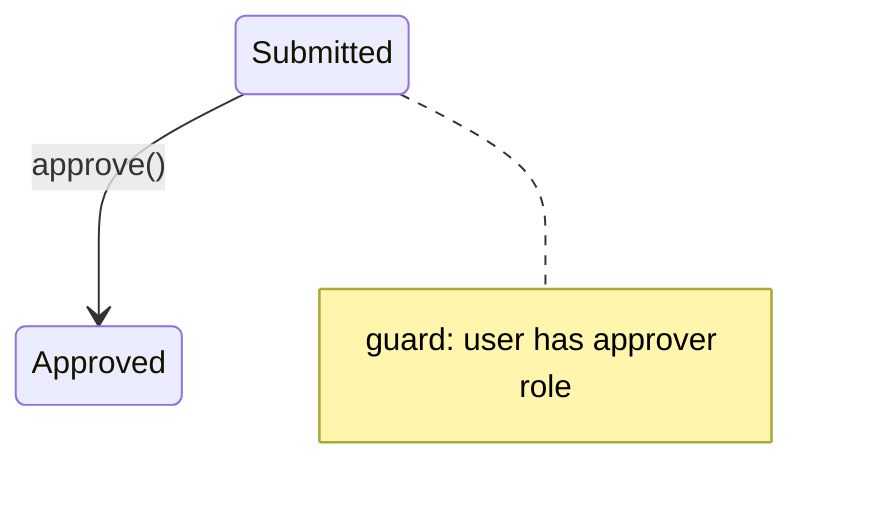

No canonical state example yet — follow the cheatsheet block above.

## 8. Flowchart (decision / process)

Used for `flowchart-<name>`, `decision-<name>`, `business-logic-<sc-id>`.

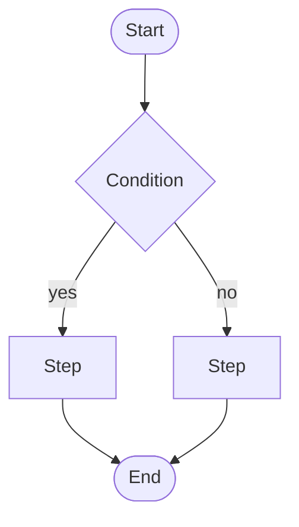

- `{...}` decision, `[...]` process, `([...])` start / end,
  `[[...]]` subroutine, `[/.../]` input/output.
- Label every edge coming out of a decision node.

Canonical example (generic request with retry loop):
[`examples/flowchart-generic-request.md`](examples/flowchart-generic-request.md).

## 9. Deployment — prefer PlantUML

Mermaid's flowchart is too coarse for realistic deployment diagrams
(nodes, clusters, load balancers, regions). **Fall back to PlantUML**
— see `plantuml-fallback.md`.

## Rules

- **ALWAYS** open each block with the exact fence ` ```mermaid ` —
  the validator relies on it.
- **NEVER** emit a node or edge without a source in the code or the
  host page's text.
- **ALWAYS** keep node identifiers stable across related diagrams (the
  `User` actor in the sequence must match `User` in the use-case
  diagram, unless the code disagrees).
- Avoid lowercase `end` as a node label, and avoid flowchart target IDs
  that begin with lowercase `o` or `x` immediately after an edge. Use
  `End`, quote the label, add spacing, or capitalize the target ID.
- **ALWAYS** caption the diagram above the block (`**Obrázek N** — <Czech caption>`) and include a one-line textual summary for the
  rendering-failure case (`SKILL.md` Step 2).

## 10. Shared color palette across documentation

Keep the same Mermaid color palette across the same type of diagrams in the whole documentation set. The cheatsheet should define the rule and naming convention, while the actual color values should live in concrete example diagrams.

Rules:

- Use one consistent palette per diagram type: sequence diagrams should look like other sequence diagrams, flowcharts like other flowcharts, class diagrams like other class diagrams, and use-case diagrams like other use-case diagrams.
- Reuse the same semantic class names where possible, for example `actor`, `entity`, `enum`, `request`, `process`, `decision`, `success`, `expired`, and `datastore`.
- Do not duplicate the full palette in every documentation guide. Use the examples in `resources/examples/` as the source of truth for actual `classDef`, `style`, `box`, and `themeVariables` values.
- When creating a new diagram, copy the palette from the closest existing example of the same diagram type and adjust only when the meaning of the node changes.
- Do not use color as the only carrier of meaning. Labels, shapes, and edge text must still make the diagram understandable in grayscale or when rendered without styling.
- If the target renderer strips Mermaid styling, the diagram must remain valid and understandable without colors.

Reference examples for actual colors:

- Class diagrams: [`resources/examples/class-passwordless-login.md`](examples/class-passwordless-login.md)
- Flowcharts: [`resources/examples/flowchart-generic-request.md`](examples/flowchart-generic-request.md)
- Sequence diagrams: [`resources/examples/sequence-passwordless-login.md`](examples/sequence-passwordless-login.md)
- Use-case diagrams: [`resources/examples/use-case-passwordless-login.md`](examples/use-case-passwordless-login.md)
- C4 diagrams: [`resources/examples/c4-passwordless-login.md`](examples/c4-passwordless-login.md)

## Canonical examples (user-curated)

The files above in `resources/examples/` are the source of truth for
styling and structure. Before drafting a new diagram, open the matching
example, copy its fenced block, and adapt labels and nodes to the
scenario. Do not reinvent `classDef` palettes, theme blocks, or
`subgraph` grouping — consistency across the documentation set depends
on reusing them.
