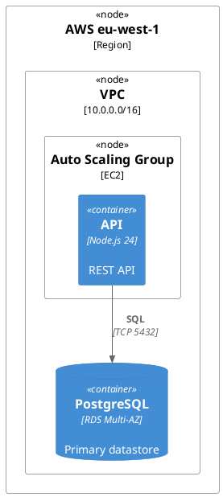
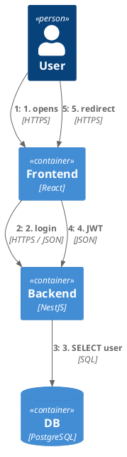
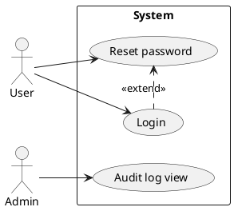
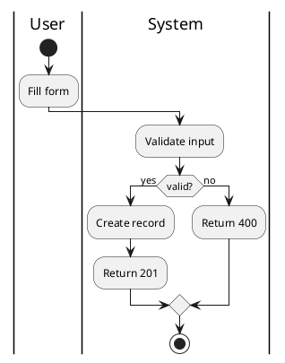

# PlantUML fallback

Mermaid is the primary diagram language in this project (§8 of
`CLAUDE.md`). PlantUML is a **fallback** — only used when Mermaid
cannot express a specific diagram cleanly. Every PlantUML block must
carry a one-line comment above it explaining _why_ Mermaid was
insufficient, so future maintainers can re-evaluate.

## When to use PlantUML

Use PlantUML only in the following cases. If none applies, stay with
Mermaid.

| Case                             | Reason                                                  |
| -------------------------------- | ------------------------------------------------------- |
| Deployment diagrams              | Mermaid flowchart cannot express nodes, clusters, zones |
| Complex C4 (dynamic, deployment) | Mermaid `C4Dynamic` / `C4Deployment` are unreliable     |
| Rich use-case (include / extend) | Mermaid has no first-class use-case syntax              |
| Full BPMN with pools / lanes     | Mermaid lacks pool / swimlane semantics                 |
| Complex activity with partitions | Mermaid flowchart has limited swimlane support          |

When in doubt, pick Mermaid first and downgrade the diagram to a
simpler type (per `diagram-type-decision.md`) before switching
languages.

## Fenced block format

````markdown

```plantuml
@startuml
...
@enduml
```

<!-- Fallback na PlantUML: <why Mermaid nestačí> -->


````

- The HTML comment with the fallback reason is **mandatory** — it is
  the contract for why we broke the "Mermaid first" rule.
- `@startuml` / `@enduml` are required for the validator.

## Canonical templates

### Deployment diagram



### C4 dynamic / C4 deployment



### Use-case (include / extend)



### BPMN-style swimlanes (activity with partitions)

Only if the project does **not** keep real BPMN XML. If it does, embed
the BPMN image from the repo instead of redrawing.



## Rendering notes

- Not all VitePress setups render PlantUML in-page. If rendering is
  unreliable, generate a PNG via `plantuml` CLI into
  `docs/images-diagrams/diagrams/` and link it **below** the fenced
  block — keep both (source + image) per `SKILL.md` "Output" section.
- PNG filename: `<anchor-name>.png` (e.g. `deployment-prod.png`).
- Never drop the fenced source in favor of the image — text-first
  maintenance requires the source.

## Evidence and consistency

PlantUML blocks are subject to the same rules as Mermaid:

- Every node, edge, and label must be traceable to code or the host
  text (`evidence-rules.md`).
- Step 3 consistency check (`consistency-check.md`) runs against both
  languages equally.
- Syntactic validation (`scripts/validate-diagram.sh`) covers both
  ` ```mermaid ` and ` ```plantuml ` blocks.

## Rules

- **NEVER** use PlantUML "because you prefer it" — use it only when
  Mermaid genuinely cannot express the diagram.
- **ALWAYS** state the fallback reason in the HTML comment above the
  block.
- **ALWAYS** wrap the source between `@startuml` / `@enduml`.
- **ALWAYS** keep Czech in captions and summaries, technical terms
  (service / class / container names) in the original language.
